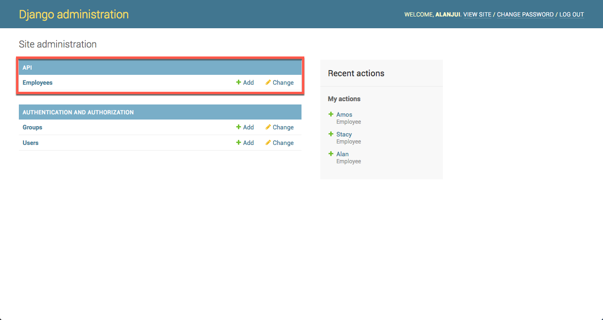
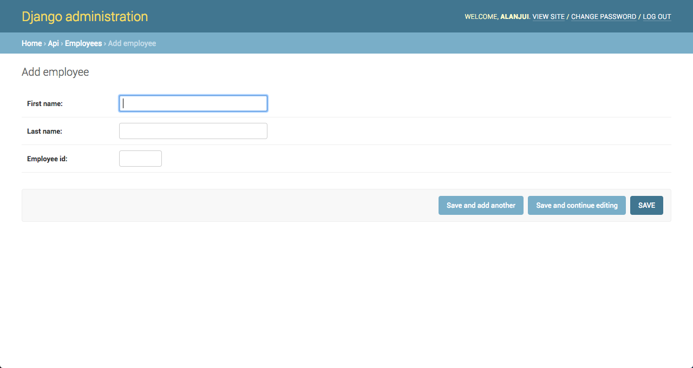
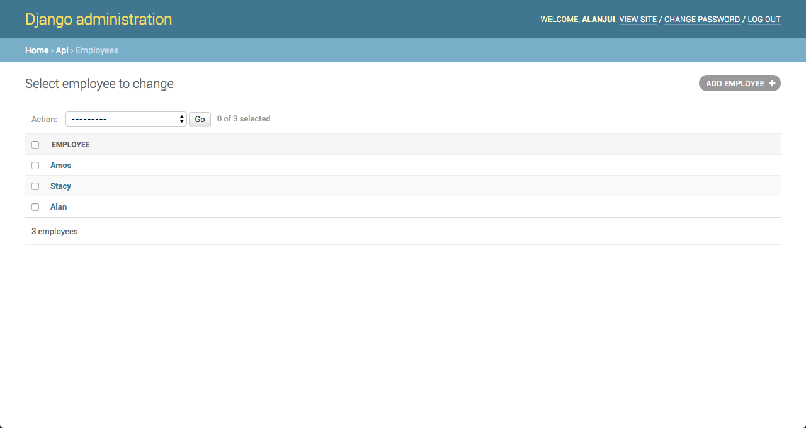
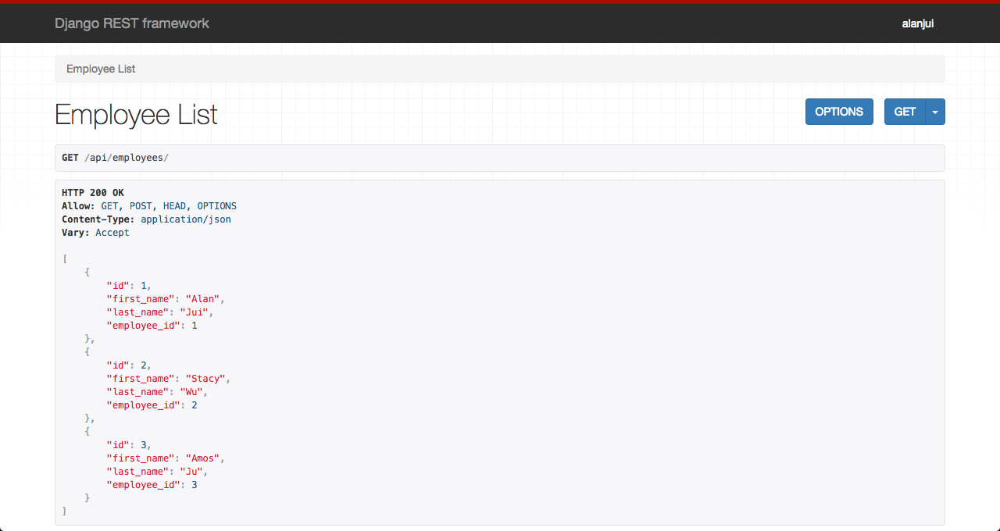

# 專案指引

本專案用於研究 Django (Web) + PostgreSQL (DB) 專案，如何導入 Docker 技術： Docker Machine + Docker Compose ， 運用於「系統開發作業」之中。

----------

## 備妥開發作業所需使用 Docker Machine 作業程序

1. docker-machine ls
2. docker-machine create test
3. docker-machine ls
4. docker-machine env test
5. eval $(docker-machine env test)
6. docker-machine ls (test: Activated)


----------

## 建置專案資料夾 

透過 docker-compose 建置 Django Project 。

### (1) 建立專案根目錄。
```
mkdir [my_project] && cd $_
```

### (2) 建立 web 目錄
```
mkdir web && cd $_
``` 

### (3) 建立 Django 專案所需使用套件庫（Libs）安裝設定檔案。
requirements:
```
Django==1.11.8
djangorestframework==3.7.7
psycopg2==2.7.3.2
pytz==2017.3
uWSGI==2.0.15
```

### (4) 建立 Web 用 Docker Image 的建置腳本檔案。
Dockerfile:
```
FROM python:3.6.2

ENV PYTHONUNBUFFERED 1

RUN mkdir /code
WORKDIR /code

ADD requirements.txt /code/
RUN pip install -r /code/requirements.txt

ADD ./ /code/
```

### (5) 建立 docker compose 用腳本檔案。
docker-compose.yml:
```
cd ..
```

docker-compose.yml:
```
version: '3.1'

services:

  web:
    build: ./web/
    container_name: web_django
    ports:
      - "8000:8000"
    volumes:
      - ./web:/code    # mounts ./web in host to /code in container
    command: django-admin startproject my_site .    # Initial Django project
    networks:
      - backend

networks:
  backend:
```

### (6) 使用 docker compose 建置開發環境所需使用之 Docker Image 檔案。
```
docker-compose build
⋯⋯
Successfully built 807529dfa459
Successfully tagged dockermachinetemplatedjango_web:latest


$ docker image ls
REPOSITORY                        TAG                 IMAGE ID            CREATED             SIZE
dockermachinetemplatedjango_web   latest              807529dfa459        2 minutes ago       744MB
dockermachinedjango_web           latest              5f0da141ca6c        13 hours ago        744MB
intellij/docker/compose           1.11.2-3            44ca62c0ce12        13 hours ago        59.4MB
pycharm_helpers                   PY-173.4301.16      e9e3e56e9ce6        13 hours ago        34.7MB
dockercomposedjangorest_web       latest              085699979f77        23 hours ago        744MB
byobprofilesrestapi_web           latest              0edb5d1004e0        38 hours ago        745MB
busybox                           latest              5b0d59026729        6 days ago          1.15MB
microsoft/mssql-server-linux      latest              cb3198f4b4d3        3 weeks ago         1.35GB
postgres                          10.1                ec61d13c8566        7 weeks ago         287MB
python                            3.6.2               26acbad26a2c        4 months ago        690MB
mongo                             3.4.2               5bc602c0b7fe        10 months ago       360MB
docker/compose                    1.11.2              61252c282969        11 months ago       59.4MB
ubuntu                            latest              45bc58500fa3        16 months ago       127MB
nginx                             latest              4efb2fcdb1ab        17 months ago       183MB
hello-world                       latest              b77358fac48b        2 years ago         960B
```

(7) 完成 web/my_site 之 Django Project 建置。
```
docker-compose up
```

(8) 設定目錄/檔案使用權限

    sudo chown -R $USER:$USER web/my_site
    sudo chown -R $USER:$USER web/manage.py


----------

## 驗證 docker machine 已能使用作業程序

驗證 docker machine: test

(1) docker-machine ssh test

(2) docker image ls

    docker@test:~$ docker image ls
    REPOSITORY                        TAG                 IMAGE ID            CREATED             SIZE
    dockermachinetemplatedjango_web   latest              d73ef1b903c2        49 seconds ago      744MB
    python                            3.6.2               26acbad26a2c        4 months ago        690MB

(3) docker ps

    docker@test:~$ docker ps
    CONTAINER ID        IMAGE                             COMMAND                  CREATED              STATUS              PORTS                    NAMES
    cd1b4102ae5e        dockermachinetemplatedjango_web   "python manage.py ru…"   About a minute ago   Up About a minute   0.0.0.0:8000->8000/tcp   django_web

(4) docker network ls

    docker@test:~$ docker network ls
    NETWORK ID          NAME                                  DRIVER              SCOPE
    a87dd2cff698        bridge                                bridge              local
    d8904f722f5c        dockermachinetemplatedjango_backend   bridge              local
    5ed18abec20c        host                                  host                local
    0cfefc68787f        none                                  null                local

(5) Web URL：   http://127.0.0.1:8000 ==> OK

(6) Web URL :     http://192.168.99.101:8000 ==> Fail (Test的 IP 尚未加入 my_site/setting.py 中的 ALLOWED_HOST

(7) 先變更 ALLOWED_HOST 的設定。

(8)Web URL :     http://192.168.99.101:8000 ==> OK

----


## 加 PostgreSQL 資料庫

(1) 關閉 docker-compose

    docker-compose down

(2)  變更 my_site/setting.py 中的 DATABASE = { … }

(3) 變更 /docker-compose.yml

(4) 啟動 docker-compose

    docker-compose up


    $ docker-compose ps
       Name                  Command               State           Ports
    -----------------------------------------------------------------------------
    db_postgres   docker-entrypoint.sh postgres    Up      0.0.0.0:5432->5432/tcp
    web_django    python manage.py runserver ...   Up      0.0.0.0:8000->8000/tcp

(5) 驗證 Host 端已有 Volume: db-dtat 被啟用。

    $ docker volume ls
    DRIVER              VOLUME NAME
    local               059355b07e63555402dd9c9a5816dc3350288f455cba8644a142588a4b5df24c
    ......
    local               dockermachinetemplatedjango_db-data
    ......
    local               ms-sql-db-vol

(6) 初始化資料庫

    docker-compose exec web ./manage.py migrate
    docker-compose exec web ./manage.py createsuperuser


    docker-compose exec web bash

(7) pgAdmin 4 可管理 db_postgres container


----------


## 加 API

(1) 進入 web 目錄

    cd web

(2) Create App

    docker-compose exec web ./manage.py startapp api

(3) my_site/setting.py  

    INSTALLED_APP =  [
      加 rest_framework, api
    ]  


(4) api/admin.py  

    from django.contrib import admin
    
    from .models import Employee
    
    # Register your models here.
    admin.site.register(Employee)
    

(5) api/models.py

    from django.db import models
    
    
    # Create your models here.
    class Employee(models.Model):
        first_name = models.CharField(max_length=10)
        last_name = models.CharField(max_length=10)
        employee_id = models.IntegerField()
    
        def __str__(self):
            return self.first_name
    

(5) api/serializers.py

    from rest_framework import serializers
    
    from .models import Employee
    
    
    class EmployeeSerializer(serializers.ModelSerializer):
        class Meta:
            model = Employee
            # fields = ('first_name', 'last_name')
            fields = '__all__'
    

(6) api/views.py

    from django.shortcuts import render
    from django.http import HttpResponse
    from django.shortcuts import get_object_or_404
    from rest_framework.views import APIView
    from rest_framework.response import Response
    from rest_framework import status
    
    from .models import Employee
    from .serializers import EmployeeSerializer
    
    
    # Create your views here.
    class EmployeeList(APIView):
    
        def get(self, request):
            employee_list = Employee.objects.all()
            serializer = EmployeeSerializer(employee_list, many=True)
            return Response(serializer.data)
    
        def post(self):
            pass


===

(7) my_site/urls.py

    from django.conf.urls import url
    from django.contrib import admin
    from rest_framework.urlpatterns import format_suffix_patterns
    from api import views
    
    urlpatterns = [
        url(r'^admin/', admin.site.urls),
        url(r'^api/employees', views.EmployeeList.as_view()),
    ]
     

===

(8) 加 api/modeels.py 所定義 model 至資料庫

    docker-compose exec web ./manage.py makemigrations api
    docker-compose exec web ./manage.py migrate

(9) 透過 admin 驗證
    http://192.168.99.101:8000/admin/


(10) 為 employees 增加資料





(11) 驗證 API 已能運行

    http://192.168.99.101:8000/api/employees/




